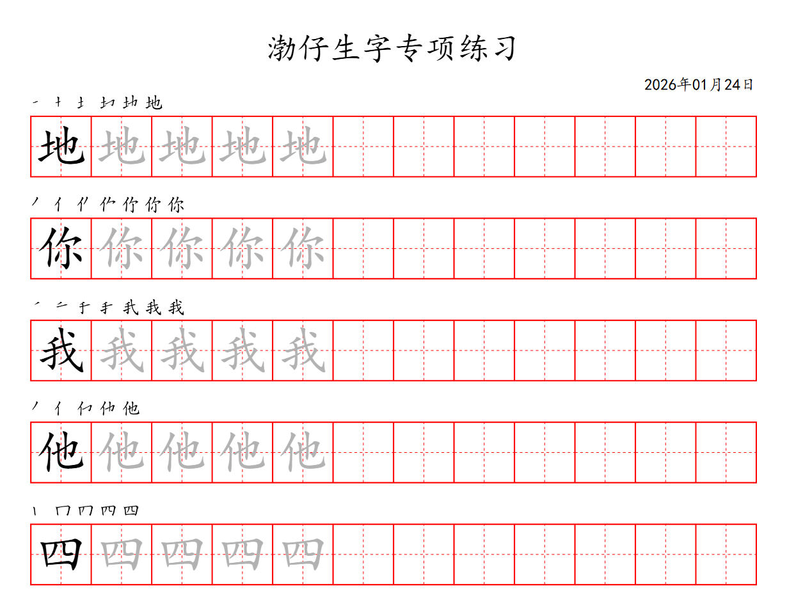

# 汉字田字格书写练习生成器

这是一个简单的 Python 工具，用于生成 PDF 格式的汉字田字格书写练习纸。



## 功能特点

*   **自定义汉字**：可以自由设置需要练习的汉字列表。
*   **笔顺演示**：支持显示汉字的笔画顺序，辅助学习。
*   **标准排版**：
    *   第一个字为黑色实体（范例）。
    *   支持自定义描红字数量（默认 4 个，可配置为整行描红）。
    *   后续格子为空白田字格（独立练习）。
*   **自动分页**：支持大量汉字，自动生成多页 PDF，底部包含页码。
*   **智能标题**：首页显示标题，支持自动生成当天日期或自定义日期格式。
*   **配置分离**：所有配置项都在单独的文件中，方便修改。

## 推荐用法：配合 127 学习法

本工具非常适合配合 **127 学习法** 进行针对性突破：

1.  **撒网听写**：先对孩子进行广泛的听写测试。
2.  **筛选生字**：记录下孩子听写错误或不会写的生字。
3.  **生成练习**：将这些生字输入到本工具的配置文件中，生成专属的练习 PDF。
4.  **精准攻克**：打印出来让孩子进行针对性的笔顺和书写练习，快速掌握薄弱环节。

## 目录结构

```
study-font-write/
├── config/
│   └── settings.py      # 配置文件 (修改汉字、日期、字体、颜色等)
├── data/                # 存放笔顺数据文件
├── output/              # 生成的 PDF 文件存放位置
├── utils/               # 工具模块
│   └── stroke_manager.py # 笔顺管理工具
├── create_practice_pdf.py # 主程序脚本
└── README.md            # 说明文档
```

## 使用方法

### 1. 安装依赖

确保你已经安装了 Python，然后安装所需的第三方库：

```bash
pip install reportlab requests svglib
```

### 2. 修改配置 (可选)

打开 `config/settings.py` 文件，你可以修改以下内容：

*   `INPUT_TEXT`: 要练习的汉字字符串。
*   `DATE_TEXT`: 日期显示设置 (`"today"` 显示当天，`None` 显示下划线)。
*   `SHOW_STROKE_ORDER`: 是否显示笔顺。
*   `FONT_PATH`: 字体文件路径 (默认使用 Windows 楷体)。
*   `GRID_COLOR`: 田字格颜色。
*   `TEXT_COLOR_DASHED`: 描红字的颜色。
*   其他排版参数...

### 3. 运行程序

在项目根目录下运行：

```bash
python create_practice_pdf.py
```

### 4. 查看结果

生成的 PDF 文件将保存在 `output` 文件夹中，默认文件名为 `hanzi_practice.pdf`。

## 常见问题

*   **找不到字体**：请检查 `config/settings.py` 中的 `FONT_PATH` 是否正确指向了你电脑上的字体文件。
*   **乱码**：确保使用的字体支持中文（推荐使用楷体或黑体）。
