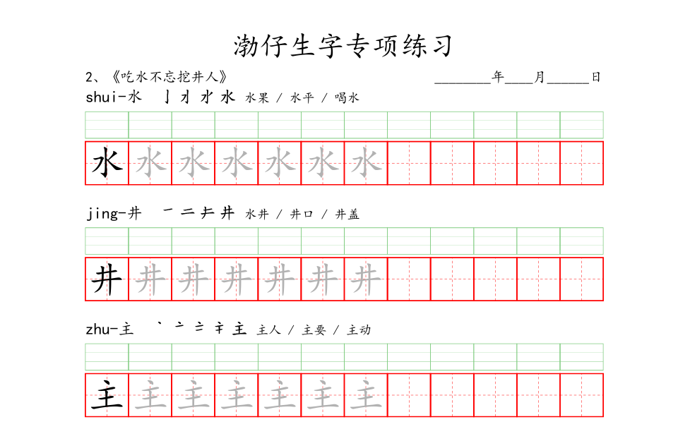

# 汉字田字格书写练习生成器

这是一个简单的 Python 工具，用于生成 PDF 格式的汉字田字格书写练习纸。



## 功能特点

*   **自定义汉字**：可以自由设置需要练习的汉字列表。
*   **拼音注音**：每个字的拼音自动显示，帮助学生理解发音。
*   **拼音格**：在田字格上方提供绿色拼音格，用于手写拼音练习。
*   **笔顺演示**：支持显示汉字的笔画顺序，行布局清晰：`拼音-字 + 笔画步骤 + 组词`（所有元素对齐）。
*   **AI 词语生成**：使用 AI（DeepSeek）自动生成每个汉字的常用词语，并智能缓存避免重复调用。
*   **标准排版**：
    *   第一个字为黑色实体（范例）。
    *   支持自定义描红字数量（默认 6 个，可配置为整行描红）。
    *   后续格子为空白田字格（独立练习）。
*   **自动分页**：支持大量汉字，自动生成多页 PDF，底部包含页码（格式：副标题 - 页码）。
*   **灵活标题**：
    *   首页显示主标题。
    *   支持副标题和日期栏（副标题在左，日期在右）。
    *   支持自动生成当天日期或自定义日期格式。
*   **配置分离**：所有配置项都在单独的文件中，方便修改。

## 推荐用法：配合 127 学习法

本工具非常适合配合 **127 学习法** 进行针对性突破：

1.  **撒网听写**：先对孩子进行广泛的听写测试。
2.  **筛选生字**：记录下孩子听写错误或不会写的生字。
3.  **生成练习**：将这些生字输入到本工具的配置文件中，生成专属的练习 PDF。
4.  **精准攻克**：打印出来让孩子进行针对性的笔顺和书写练习，快速掌握薄弱环节。

## 目录结构

```
study-font-write/
├── config/
│   ├── settings.py          # 配置文件 (修改汉字、日期、字体、颜色、API 等) - 不需提交
│   └── settings.py.example  # 配置文件示例 (参考模板)
├── data/                    # 存放笔顺数据文件
├── output/                  # 生成的 PDF 文件存放位置
├── utils/                   # 工具模块
│   └── stroke_manager.py    # 笔顺管理工具
├── create_practice_pdf.py   # 主程序脚本
└── README.md                # 说明文档
```

## 使用方法

### 1. 安装依赖

确保你已经安装了 Python，然后安装所需的第三方库：

```bash
pip install reportlab requests svglib openai pypinyin
```

### 2. 配置 API 和其他参数

**首次使用，需要从示例配置文件创建配置：**

```bash
# Windows
copy config\settings.py.example config\settings.py

# Mac/Linux
cp config/settings.py.example config/settings.py
```

然后打开 `config/settings.py` 文件，根据你的需求修改以下内容：

*   `INPUT_TEXT`: 要练习的汉字字符串。
*   `SUBTITLE`: 副标题（显示在日期栏左边，也会出现在页码中），例如 `"姓名：___________"` 或 `"2、《吃水不忘挖井人》"`。
*   `DATE_TEXT`: 日期显示设置 (`"today"` 显示当天，`None` 或 `""` 显示下划线)。
*   `SHOW_STROKE_ORDER`: 是否显示笔顺和拼音。
*   `FONT_PATH`: 字体文件路径 (默认使用 Windows 楷体)。
*   **拼音格设置**：
    *   `PINYIN_GRID_HEIGHT`: 拼音格高度（默认 8mm）。
    *   `PINYIN_GRID_COLOR`: 拼音格颜色（默认深绿色）。
    *   `PINYIN_SPACING`: 拼音格与田字格间距（默认 1mm）。
*   **田字格设置**：
    *   `GRID_SIZE`: 田字格大小。
    *   `GRID_COLOR`: 田字格颜色。
    *   `TRACE_COUNT`: 描红字数量（默认 6 个）。
*   `TEXT_COLOR_DASHED`: 描红字的颜色。
*   **`OPENAI_BASE_URL`**: 将 `http://your-api-base-url/v1` 替换为实际的 API 地址。
*   **`OPENAI_API_KEY`**: 将 `sk-your-api-key-here` 替换为实际的 API Key。
*   `OPENAI_MODEL`: 使用的模型名称（推荐 `deepseek-v3-zspace`）。
*   其他排版参数...

> **提示**：AI 生成的词语会自动缓存到 `.words_cache.json`，下次运行时直接使用缓存，不会重复调用 API，节省成本。
>
> **重要**：不要将 `settings.py` 提交到版本控制系统，使用 `settings.py.example` 作为模板共享配置结构。

### 3. 运行程序

在项目根目录下运行：

```bash
python create_practice_pdf.py
```

### 4. 查看结果

生成的 PDF 文件将保存在 `output` 文件夹中，默认文件名为 `hanzi_practice.pdf`。

## 常见问题

*   **找不到字体**：请检查 `config/settings.py` 中的 `FONT_PATH` 是否正确指向了你电脑上的字体文件。
*   **乱码**：确保使用的字体支持中文（推荐使用楷体或黑体）。
*   **AI 调用失败**：
    *   检查 `OPENAI_BASE_URL` 和 `OPENAI_API_KEY` 是否配置正确。
    *   检查网络连接是否正常。
    *   确保有网络访问权限（如需要代理，请在 `config/settings.py` 中设置）。
*   **如何清除词语缓存**：删除 `data/.words_cache.json` 文件，下次运行时会重新生成。
